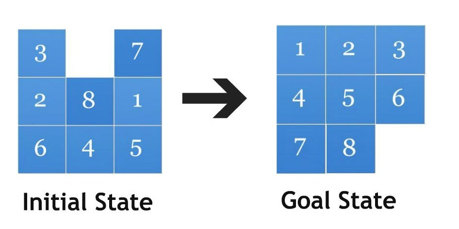

# IA para jogar 8 Puzzle Game.

## IA criada para resolver o jogo 8 Puzzle, utilizando o algoritmo de busca A\*.

> O código fonte está escrito em inglês, porém o programa roda em português.

### Como rodar na sua máquina?

- É necessário ter o Python instalado em sua última versão.

#### Instalando na sua máquina:

```bash
$ git clone https://github.com/JotahIvo/8-puzzle-game-with-AI.git
$ cd 8-puzzle-game
```

#### Executando:

```bash
$ python puzzle8_ia.py
```

---

### Como funciona o algoritmo?

O 8 Puzzle Game é um jogo onde você tem uma matriz 3x3 preenchidas de números que vão de 1 a 8, o número 0 rpresenta o espaço em branco.

Esses números estão embaralhados e você deve ordena-los apenas movimentando o espaço em branco para cima, baixo, direita ou esquerda.



O estado inicial é completamente aleatório e é garantido que ele tenha solução devido a função que verifica a paridade do estado.

A Heurística escolhida para a busca foi a "Distância de quarteirão", que é soma das distâncias dos elementos no seu estado atual até seu estado final.

## Obrigado!
